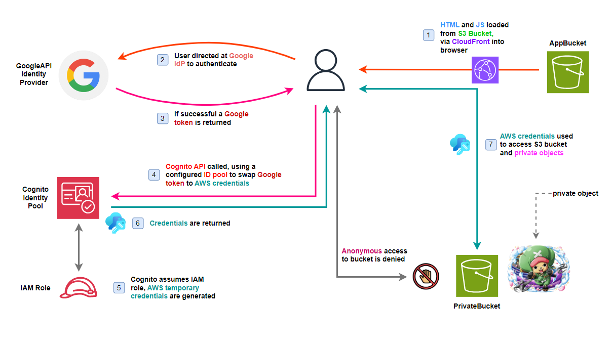

## Introduction

In this workshop, we will explore and practice modern techniques to protect cloud resources, specifically the Amazon S3 object storage service. With the continuous development of web and mobile applications, data management and protection becomes increasingly important and complex. That's why understanding and applying effective authentication methods is essential for anyone working in information technology.

We will focus on two important technologies:

1. OAuth 2.0 - an open authentication protocol, helping applications to safely access resources on other services (Specifically here we will use Google OAuth).
2. Amazon Cognito - AWS's identity management service, allows us to easily add user login, registration, and authentication functionality to applications.

## Lab logic

1. HTML and JS files are loaded from S3 via CloudFront into the browser.
2. The user visits the website url provided by CloudFront and logs in to their Google account.
3. If login is successful, a token is returned by Google API.
4. Cognito API is called with the pool ID we configured before, from Google token we get AWS credentials.
5. Cognito will attach to the AWS credentials role and configure the ID pool.
6. Credentials with the attached role are returned.
7. Use the returned credentials to interact with objects in the private bucket.

## Through this lab, it can help us:

- Better understand how OAuth 2.0 and Amazon Cognito work.
- Know how to configure and integrate AWS services to protect resources on S3.
- Confidently apply knowledge to real projects.

Now, let's get started!
