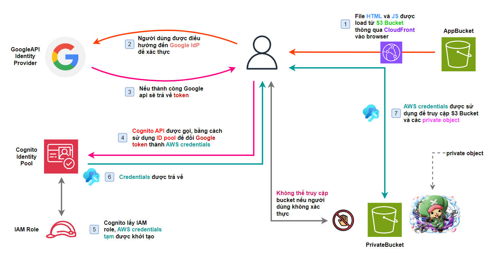

## Giới thiệu

Ở bài lab này, chúng ta sẽ cùng nhau khám phá và thực hành các kỹ thuật hiện đại để bảo vệ tài nguyên trên đám mây, cụ thể là dịch vụ lưu trữ đối tượng Amazon S3. Với sự phát triển không ngừng của các ứng dụng web và di động, việc quản lý và bảo vệ dữ liệu trở nên ngày càng quan trọng và phức tạp. Đó là lý do tại sao việc hiểu rõ và áp dụng các phương pháp xác thực hiệu quả là điều cần thiết cho bất kỳ ai đang làm việc trong lĩnh vực công nghệ thông tin.

Chúng ta sẽ tập trung vào hai công nghệ quan trọng:

1. OAuth 2.0 - một giao thức xác thực mở, giúp các ứng dụng có thể truy cập tài nguyên trên các dịch vụ khác một cách an toàn (Cụ thể ở đây chúng ta sẽ dùng Google OAuth).
2. Amazon Cognito - dịch vụ quản lý danh tính của AWS, cho phép chúng ta dễ dàng thêm chức năng đăng nhập, đăng ký, và xác thực người dùng cho ứng dụng.

## Logic bài lab

1. File HTML và JS được load từ S3 thông qua CloudFront vào browser.
2. Người dùng truy cập trang web url được CloudFront cung cấp và đăng nhập tài khoản Google.
3. Nếu đăng nhập thành công, một token được Google api trả về.
4. Cognito API được gọi với ID pool chúng ta đã cấu hình từ trước, từ Google token chúng ta lấy được AWS credentials.
5. Cognito sẽ gắn vào AWS credentials role chúng ta cấu hình cho ID pool.
6. Credentials với role được gắn được trả về.
7. Dùng credentials được trả về để tương tác với các object trong private bucket.

## Qua bài lab này có thể giúp chúng ta:

- Hiểu rõ hơn về cách hoạt động của OAuth 2.0 và Amazon Cognito.
- Biết cách cấu hình và tích hợp các dịch vụ của AWS để bảo vệ tài nguyên trên S3.
- Tự tin áp dụng kiến thức vào các dự án thực tế.

Nào, giờ chúng ta cùng bắt đầu thôi!
